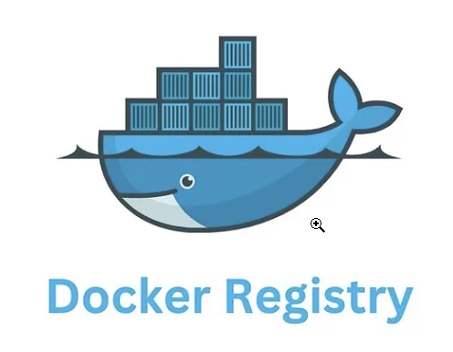

# 🐳 **Private Docker Registry Setup Guide**

<p align="center">
  
</p>

## 🧠 What is a Docker Private Registry?

A **Docker Private Registry** is a secure, self-hosted server where you can **store, manage, and distribute your Docker images privately** — instead of using the public Docker Hub.
It’s ideal for organizations that need to:

* Keep images **confidential** (e.g., internal or proprietary apps) 🔒
* Have **faster deployments** (local network access) ⚡
* Maintain **control over versioning and access** 🔐

You can host it on your own infrastructure or within a cloud environment, using Docker’s built-in registry image (`registry:3`).


## ⚙️ **Prerequisites**

Before you begin, make sure you have the following:

* 🧩 **Operating System:** Ubuntu 20.04 or later
* 🐋 **Docker Installed**
* 🧱 **Docker Compose Installed**
* 💾 **Storage:** At least 50GB of free space
* 🔑 **Root or sudo access**


## 📁 **Paths & Environment Setup**

This section covers setting up directories and environment variables for your registry.


🧾 **Variables**

```
DOCKER_VOLUME_STORAGE=/HDD2TB/iansari/docker_registry
DOKCER_USER=docker
DOKCER_PASSWORD=docker
```


## 🧱 Directory Preparation

```bash
sudo mkdir -p $DOCKER_VOLUME_STORAGE/auth
sudo chmod -R 777 $DOCKER_VOLUME_STORAGE
cd $DOCKER_VOLUME_STORAGE
```


## 🔐 Create Authentication File

Pull the Apache HTTPD image and generate a password file for registry authentication:

```bash
docker pull httpd:2
docker run --rm \
  --entrypoint htpasswd \
  httpd:2 -Bbn $DOKCER_USER $DOKCER_PASSWORD > ./auth/registry.password
```

🧾 **View generated password file:**

```bash
cat $DOCKER_VOLUME_STORAGE/auth/registry.password
```


## ⚙️ Environment Configuration

Edit your `.env` file:

```bash
nano .env
```

**Example content:**

```bash
COMPOSE_PROJECT_NAME=docker_hub
DOCKER_VOLUME_STORAGE=/HDD2TB/iansari/docker_registry
SECRET_KEY_BASE=daf5a62e43a527c40d6533cc4e332906614f6ac910548a341fcd2da7d869d86238ecd211410032cb952db8802c1bad7b0b5d1d8e42fc4a32f6ac71ce2fe03239
```


## 🧩 Docker Compose Setup

Create and edit the `compose.yaml` file:

```bash
nano compose.yaml
```

Then start the stack:

```bash
docker compose up -d
```


## 📋 Monitoring Logs

🔁 **Follow all logs:**

```bash
docker compose logs -f
```

📦 **Follow specific service logs:**

```bash
docker compose logs -f registry-ui
docker compose logs -f registry-server
```


## 🐳 Docker Configuration Check

Inspect the running registry configuration:

```bash
docker exec -it registry_server cat /etc/distribution/config.yml
```


## 🌐 Nginx Reverse Proxy Configuration

### 🧩 Nginx Proxy Manager (NPM) → Host → Advanced Tab

```nginx
client_max_body_size 2000M;
client_max_body_size 0; # Unlimited
```


## 🧭 DNS & Host Configuration

Add DNS entry in **Pi-hole** or your local DNS:

```
hub.devopsinaction.lab → 192.168.1.102
```

Or, if DNS is not configured, add to `/etc/hosts`:

```bash
192.168.1.102 hub.devopsinaction.lab
```


## 🌍 Nginx Proxy Manager Setup

Add a new proxy host:

| Setting        | Value                             |
| -- |  |
| **Domain**     | `https://hub.devopsinaction.lab/` |
| **Forward IP** | `192.168.1.102`                   |
| **SSL**        | Apply wildcard SSL certificate ✅  |


## 🔑 Test Docker Login

Try logging in to your new private registry:

```bash
docker login https://hub.devopsinaction.lab/
```

When prompted:

```
Username: docker
Password: docker
```

Or directly:

```bash
docker login https://hub.devopsinaction.lab/ -u docker -p docker
```

Push Image
docker tag ibraransaridocker/network-debug-tools hub.devopsinaction.lab/network-debug-tools
docker push hub.devopsinaction.lab/network-debug-tools


## 🖥️ Test Web GUI

Access the Registry UI:

🔗 **URL:** [https://hubdash.devopsinaction.lab/](https://hubdash.devopsinaction.lab/)
👤 **Username:** `docker`
🔒 **Password:** `docker`


✅ **All done!**
Your private Docker registry is now set up, secured, and accessible with a GUI dashboard 🚀
